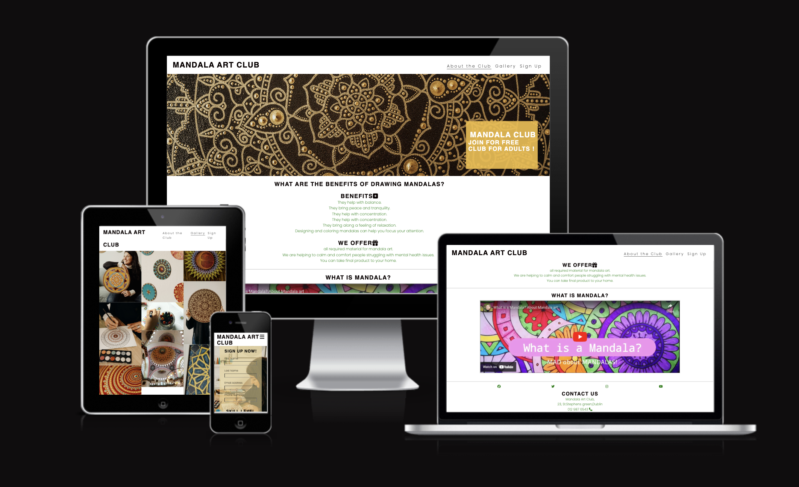

# Mandala Art Club
## Summary
Mandala art club is a website that helps you to learn how to draw a mandal art and this art helps you to calm and comfort people struggling with mental health issues.

View the live website here - [Mandal Art Club](https://meghanarajvinakota.github.io/mandala-art-club/ "Mandala-Art-Club")

## Features
### Existing Features

#### [In The Net - Homepage (Page 1)]

- __Navigation Bar__

 - Featured on all three pages, the full responsive navigation bar includes links to the Logo, About the club, Gallery and Sign Up page and is identical in each page to allow for easy navigation.
  - This section will allow the user to easily navigate from page to page across all devices without having to revert back to the previous page via the ‘back’ button. 

