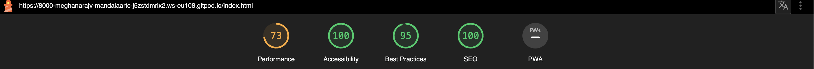

# Mandala Art Club
## Summary
Mandala art club is a website that helps you to learn how to draw a mandal art and this art helps you to calm and comfort people struggling with mental health issues.

View the live website here - [Mandal Art Club](https://meghanarajvinakota.github.io/mandala-art-club/ "Mandala-Art-Club")

## Features
### Existing Features

#### [Mandala art club - ABOUT US page (Page 1)]

- __Navigation Bar__

 - Featured on all three pages, the full responsive navigation bar includes links to the Logo, About the club, Gallery and Sign Up page and is identical in each page to allow for easy navigation.
  - This section will allow the user to easily navigate from page to page across all devices without having to revert back to the previous page via the ‘back’ button. 

- __The landing page image__

  - The landing includes a photograph with text overlay to allow the user to see exactly who are eligible to joined and it is for free.
  - This section introduces the user to how mandala art looks like.

  

- __Benefits section__

  - In this section user will know what are the benefits of drawing manadlas.
  - The user will see more about what is they are going to offer and what will they get.

  

- __video section__

  - In this section user will know more about what is manadala.
  - The user will allow to access a youtube video.

  

- __contactus section__

  - In this section user will know contact number and addreess.

  

- __Footer section__

   - The footer section includes links to the relevant social media sites for Mandala art club. The links will open to a new tab to allow easy navigation for the user. 
  - The footer is valuable to the user as it encourages them to keep connected via social media.

  

- __Gallery__

  - The gallery will provide the user with supporting images to see what Mandala look like.
  - This section is valuable to the user as they will be able to easily identify the types of Mandalas. 

- __The Sign Up Page__

  - This page will allow the user to get signed up to Mandala art journey with the club. The user will be able specify if they would select their skill level trail or both types of running. 
  - The user will be asked to submit their full name ,email address and contact number.

## Edits

Once the website was actually being created, there were some changes made.
Webpage is not responsive to all devices when it tested initially.
Added more styles to. media query make it responsive.

## Features Left to Implement

- __Real time updates of Events__

- On the Home page, it would be ideal to have the website dynamically update what is upcoming events.
- On Signup page ,it would be great to signup for multiple events.

- __Map__

- On Home page, for easy access to get directions it would have a map link.
- It would be ideal to change the location and search for Events.

## Testing

- The website was viewed on all devices, including a desktop, tablet, and a few iPhone and Android models, including an iPhone X, an iPhone XR and Iphone 14pro.
- This website has been viewed and tested on Google Chrome, Mozilla Firefox, Safari and Microsoft Edge.
- Family and friends were asked to navigate through the website and identify any bugs or improvements to be made.

### Lighthouse

Lighouse reports were generated on all 3 pages of the website. See below the scores:

### Validator testing

HTML: When passed through W3C Validator,no errors were found on aboutus page [Aboutus page](https://validator.w3.org/nu/?showsource=yes&doc=https%3A%2F%2F8000-meghanarajv-mandalaartc-j5zstdmrix2.ws-eu108.gitpod.io%2Findex.html)

      When passed through W3C Validator,no errors were found on gallery page [Gallery page](https://validator.w3.org/nu/?showsource=yes&doc=https%3A%2F%2F8000-meghanarajv-mandalaartc-j5zstdmrix2.ws-eu108.gitpod.io%2Fgallery.html)
      
      When passed through W3C Validator,no errors were found on signup page [Signup page](https://8000-meghanarajv-mandalaartc-j5zstdmrix2.ws-eu108.gitpod.io/signup.html)

CSS:  When passed through Jigsaw validator,no errors were found [(Jigsaw) validator](./media/cssvalidator.png)
      

